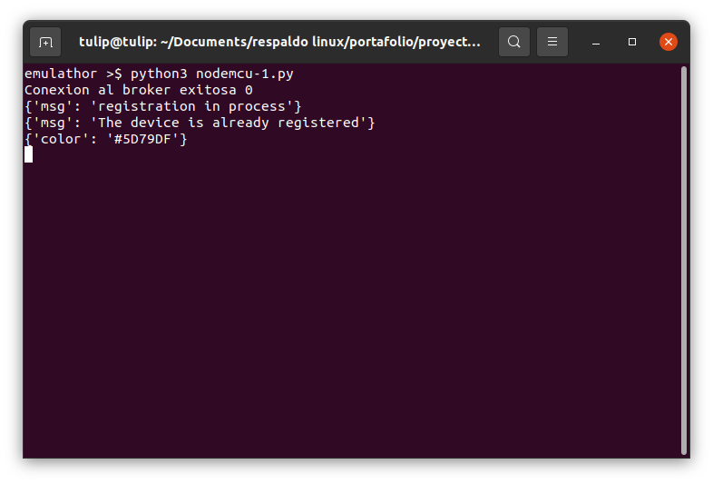

# IoT, System for rgb led strips

## About The Project

Control and configuration system for off, on and color of rgb led strip.

### Built with

* Node.js
* NoSQL
* MQTT
* JSON
* JavaScript
* CSS
* HTML
* ArangoDB
* Mosquitto
* Python

## Getting Started

### Prerequisites

Install mosquitto broker mqtt
<pre>
$ sudo apt-add-repository ppa:mosquitto-dev/mosquitto-ppa
$ sudo apt-get update
$ sudo apt-get install mosquitto
</pre>
Install eclipse paho mqtt python3
<pre>
$ pip3 install paho-mqtt 
</pre>
Install ArangoDB:
<pre>
curl -OL https://download.arangodb.com/arangodb37/DEBIAN/Release.key
sudo apt-key add - < Release.key
echo 'deb https://download.arangodb.com/arangodb37/DEBIAN/ /' | sudo tee /etc/apt/sources.list.d/arangodb.list
sudo apt-get install apt-transport-https
sudo apt-get update
sudo apt-get install arangodb3=3.7.10-1
sudo apt-get install arangodb3-dbg=3.7.10-1
</pre>

4. Internet connection

### Installing

1. Clone the repo.
<pre>
$ git clone https://github.com/oscarbmo01/IoT-rgb-led-strips.git
</pre>

2. Configuration mosquitto.conf file.
<pre>
$ sudo nano /etc/mosquitto/mosquitto.conf
</pre>
<pre>
listener 1884
protocol websockets

listener 1883
protocol mqtt

allow_anonymous true
</pre>
<pre>
$ sudo service mosquitto stop
$ sudo service mosquitto start
</pre>

3. Mosquitto broker mqtt service running.
<pre>
$ sudo service mosquitto status
</pre>

4. Arangodb database service running.
<pre>
$ sudo systemctl status arangodb3
</pre>

## Deployment

1. Create a database with the name IOTSTRIPRGBLED.

2. Add collections with names rgbLedStrip, session y users.

3. Create a new document in the rgbLedStrip collection with the following JSON format.
<pre>
{ "_keyUser": "000000" }
</pre>

4. Server running server Node.js server-nodejs directory
<pre>
$ npm start
</pre>

5. Server running server frontend web-spa directory
<pre>
$ php -S localhost:5501
</pre>
6. Emulathor NodeMCU running in emulathor-esp8266-python directory
<pre>
$ python3 nodemcu-1.py
</pre>

### Documentation

## Credits
Eclipse Foundation https://www.eclipse.org/  
Diagrams https://app.diagrams.net/  
Mosquitto https://mosquitto.org/download/  
ArangoDB https://www.arangodb.com/download-major/

## Licence

Distributed under the MIT License. See LICENSE for more information.